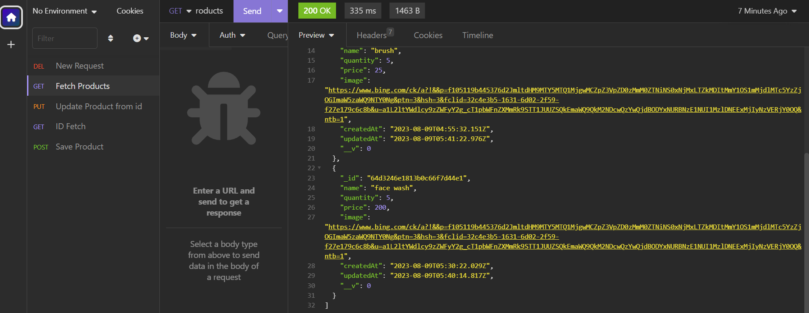
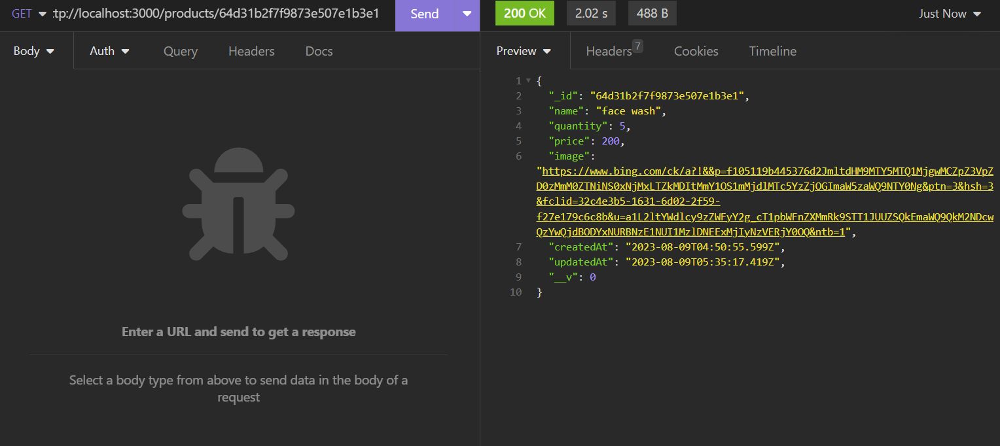

## Getting Started

1. **Installation:** Clone the repository and install the required dependencies using `npm install`.

2. **Database Setup:** Configure your MongoDB connection by providing the appropriate URI in the configuration files.

3. **Model Definition:** Define your data models by extending the provided base model. Customize the schema according to your application's needs.

4. **Routes Configuration:** Set up your API routes using Express.js. The template provides a solid foundation for handling CRUD operations effortlessly.

5. **Authentication and Authorization:** Implement authentication mechanisms to secure your API. You can customize access levels and permissions according to your application's requirements.

6. **Start the Server:** Launch your Express server using `npm start`, and your powerful CRUD API will be accessible at the specified endpoints.

## Screenshots

